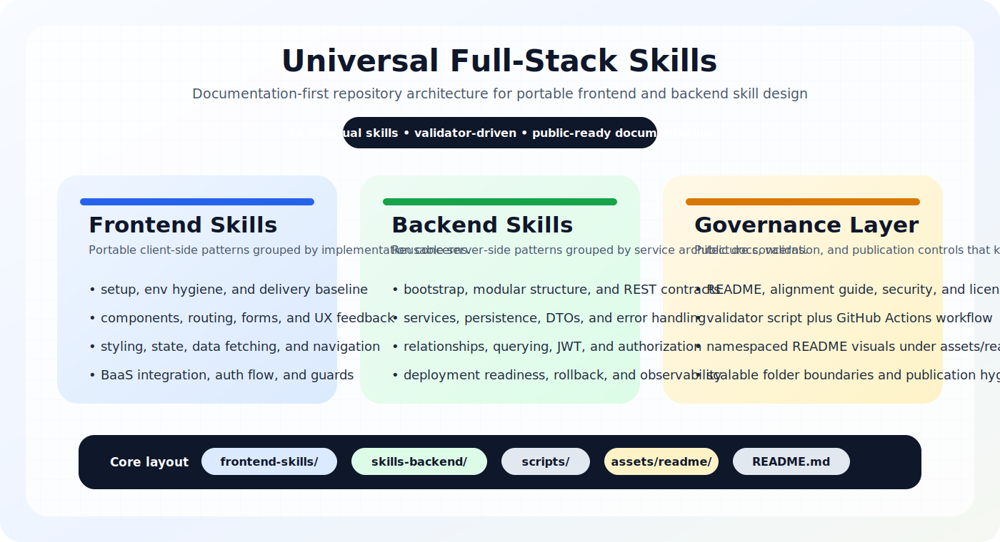
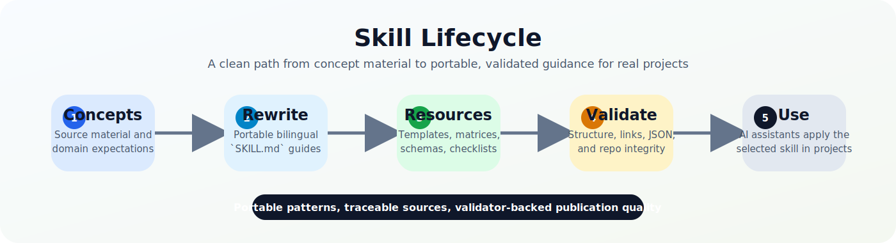

# Universal Full-Stack Skills
### 24 bilingual `SKILL.md` guides for portable frontend and backend work




This repository is a **documentation-driven skill library** for AI coding assistants. It packages reusable frontend and backend playbooks as structured `SKILL.md` files, backed by templates, matrices, JSON schemas, validation tooling, and publication guidance.

The content is based on the `CONCEPTOS-FRONTEND-BACKEND` concept material and then rewritten into portable patterns that can be adapted across frameworks instead of copying one stack as if it were universal.

## Table of Contents

- [Purpose](#purpose)
- [What the Project Includes](#what-the-project-includes)
- [How It Works](#how-it-works)
- [Repository Structure](#repository-structure)
- [Organization Principles](#organization-principles)
- [Top-Level Files and Directories](#top-level-files-and-directories)
- [Frontend Skill Catalog](#frontend-skill-catalog)
- [Backend Skill Catalog](#backend-skill-catalog)
- [Installation](#installation)
- [Usage](#usage)
- [Validation and Automation](#validation-and-automation)
- [Alignment to the Source Concepts](#alignment-to-the-source-concepts)
- [Security and Publishing](#security-and-publishing)
- [Scope and Non-Goals](#scope-and-non-goals)
- [License](#license)

## Purpose

AI assistants are powerful, but they often drift when a codebase lacks explicit implementation rules.

This repository exists to provide:

- **portable implementation guidance** for common frontend and backend tasks
- **clear architectural boundaries** around routing, services, auth, validation, deployment, and more
- **bilingual documentation** in English and Spanish
- **structured reuse** through a consistent `SKILL.md` format
- **validation before publication** so the repository can stay coherent over time

It is not a runnable application. It is a reusable knowledge and workflow layer for AI-assisted development.

## What the Project Includes

- **24 skills total**
  - 12 frontend skills in [frontend-skills/README.md](./frontend-skills/README.md)
  - 12 backend skills in [skills-backend/README.md](./skills-backend/README.md)
- **Support resources**
  - Markdown templates
  - Decision matrices
  - Checklists
  - JSON schemas
- **Repository-level documentation**
  - [GUIDE_ALIGNMENT.md](./GUIDE_ALIGNMENT.md)
  - [SECURITY.md](./SECURITY.md)
  - [LICENSE](./LICENSE)
- **Validation tooling**
  - [`scripts/validate-skills.mjs`](./scripts/validate-skills.mjs)
- **Automation**
  - GitHub Actions validation workflow
  - Dependabot configuration for GitHub Actions and npm metadata

Each `SKILL.md` follows a stable structure:

```text
1. Skill Description
2. Skill Objective
3. Inputs / Entradas
4. Outputs / Salidas
5. Execution Steps
6. Example Usage (Prompt)
7. Recommended File Structure / Estructura Recomendada
```

## How It Works



At a high level, the repository works like this:

1. A concept source defines the original topic.
2. The topic is rewritten into a portable `SKILL.md`.
3. Extra resources are attached when examples, matrices, schemas, or checklists are useful.
4. The validator checks structure, links, and JSON files.
5. An AI assistant consumes the selected skill during implementation work.

## Repository Structure

```text
.
├── .github/
│   ├── dependabot.yml
│   └── workflows/
│       └── validate-skills.yml
├── assets/
│   ├── README.md
│   └── readme/
│       ├── repository-architecture.svg
│       └── skill-lifecycle.svg
├── frontend-skills/
│   ├── 01-project-setup/
│   ├── 02-component-architecture/
│   ├── 03-routing-strategy/
│   ├── 04-form-orchestration/
│   ├── 05-ui-feedback-system/
│   ├── 06-authentication-flow/
│   ├── 07-styling-system/
│   ├── 08-state-management/
│   ├── 09-data-fetching/
│   ├── 10-advanced-navigation/
│   ├── 11-baas-integration/
│   ├── 12-route-guards/
│   └── README.md
├── scripts/
│   └── validate-skills.mjs
├── skills-backend/
│   ├── 01-project-bootstrap/
│   ├── 02-modular-project-structure/
│   ├── 03-rest-api-design/
│   ├── 04-service-layer/
│   ├── 05-data-persistence/
│   ├── 06-dto-and-validation/
│   ├── 07-error-handling/
│   ├── 08-entity-relationships/
│   ├── 09-advanced-querying/
│   ├── 10-jwt-authentication/
│   ├── 11-authorization/
│   ├── 12-production-deployment/
│   └── README.md
├── .editorconfig
├── .gitattributes
├── .gitignore
├── GUIDE_ALIGNMENT.md
├── LICENSE
├── package.json
├── README.md
└── SECURITY.md
```

## Organization Principles

The repository is intentionally organized around stable boundaries so it can keep growing without becoming messy:

- **Root level stays minimal** for public entry documents, repository metadata, automation, and validation tooling.
- **Each skill remains self-contained** inside its numbered folder, with its own `SKILL.md` and local `resources/` when extra material is needed.
- **Frontend and backend stay separated by domain** rather than mixing templates, examples, and schemas in one shared bucket.
- **Static visuals are namespaced by audience** so README assets live in `assets/readme/` instead of being scattered at the repository root.
- **Validation stays isolated in `scripts/`** so documentation structure can evolve without coupling to application code.

## Top-Level Files and Directories

| Path | Type | Purpose |
|---|---|---|
| `.github/` | Directory | Repository automation, including validation workflow and Dependabot configuration |
| `assets/` | Directory | Namespaced static assets, including public README diagrams |
| `frontend-skills/` | Directory | Frontend skill set and support resources |
| `skills-backend/` | Directory | Backend skill set and support resources |
| `scripts/` | Directory | Validation tooling |
| `.editorconfig` | File | Shared text-formatting rules |
| `.gitattributes` | File | Line-ending and binary-file handling rules |
| `.gitignore` | File | Publication hygiene and local artifact exclusions |
| `GUIDE_ALIGNMENT.md` | File | Source traceability, synthesis notes, scope, and provenance |
| `LICENSE` | File | MIT license |
| `package.json` | File | Minimal Node metadata and `npm run validate` script |
| `README.md` | File | Public project overview |
| `SECURITY.md` | File | Publication and security review guidance |

## Frontend Skill Catalog

| # | Skill | Focus |
|---|---|---|
| 01 | [project-setup](./frontend-skills/01-project-setup/SKILL.md) | Setup, aliases, environment hygiene, and delivery baseline |
| 02 | [component-architecture](./frontend-skills/02-component-architecture/SKILL.md) | Component boundaries, composition rules, and reusable UI primitives |
| 03 | [routing-strategy](./frontend-skills/03-routing-strategy/SKILL.md) | Layouts, lazy loading, route organization, and rendering strategy |
| 04 | [form-orchestration](./frontend-skills/04-form-orchestration/SKILL.md) | Form structure, validation, async checks, and server-error mapping |
| 05 | [ui-feedback-system](./frontend-skills/05-ui-feedback-system/SKILL.md) | UI feedback states, heuristics, accessibility, and user guidance |
| 06 | [authentication-flow](./frontend-skills/06-authentication-flow/SKILL.md) | Session lifecycle, hydration, and auth state transitions |
| 07 | [styling-system](./frontend-skills/07-styling-system/SKILL.md) | Tokens, theming, responsive styling, and stack-aware CSS choices |
| 08 | [state-management](./frontend-skills/08-state-management/SKILL.md) | Shared client state and separation from remote cache |
| 09 | [data-fetching](./frontend-skills/09-data-fetching/SKILL.md) | HTTP clients, repositories, interceptors, and transport-aware tests |
| 10 | [advanced-navigation](./frontend-skills/10-advanced-navigation/SKILL.md) | Breadcrumbs, URL pagination, and navigation-supporting UI patterns |
| 11 | [baas-integration](./frontend-skills/11-baas-integration/SKILL.md) | BaaS provider integration through capability adapters |
| 12 | [route-guards](./frontend-skills/12-route-guards/SKILL.md) | Auth-aware and guest-aware route protection |

For the full frontend resource index, see [frontend-skills/README.md](./frontend-skills/README.md).

## Backend Skill Catalog

| # | Skill | Focus |
|---|---|---|
| 01 | [project-bootstrap](./skills-backend/01-project-bootstrap/SKILL.md) | Entry point, runtime bootstrap, and base health contract |
| 02 | [modular-project-structure](./skills-backend/02-modular-project-structure/SKILL.md) | Feature-based structure and layer boundaries |
| 03 | [rest-api-design](./skills-backend/03-rest-api-design/SKILL.md) | REST contracts, envelopes, versioning, and OpenAPI discipline |
| 04 | [service-layer](./skills-backend/04-service-layer/SKILL.md) | Reusable business logic and transport-independent services |
| 05 | [data-persistence](./skills-backend/05-data-persistence/SKILL.md) | Repositories, entities, migrations, and persistence boundaries |
| 06 | [dto-and-validation](./skills-backend/06-dto-and-validation/SKILL.md) | DTO/schema boundaries and request validation |
| 07 | [error-handling](./skills-backend/07-error-handling/SKILL.md) | Exception mapping and safe client-facing errors |
| 08 | [entity-relationships](./skills-backend/08-entity-relationships/SKILL.md) | Ownership, relations, serialization, and data-shape boundaries |
| 09 | [advanced-querying](./skills-backend/09-advanced-querying/SKILL.md) | Filtering, sorting, and paginated response patterns |
| 10 | [jwt-authentication](./skills-backend/10-jwt-authentication/SKILL.md) | Login, token issuance, token validation, and claims discipline |
| 11 | [authorization](./skills-backend/11-authorization/SKILL.md) | RBAC, ownership, and layered access checks |
| 12 | [production-deployment](./skills-backend/12-production-deployment/SKILL.md) | Release readiness, observability, CI/CD, rollback, and runtime selection |

For the full backend resource index, see [skills-backend/README.md](./skills-backend/README.md).

## Installation

### Requirements

- **Node.js 20 or newer**
- **Git** to clone or copy the repository

### Clone the repository

```bash
git clone <your-repository-url>
cd universal-full-stack-skills
```

### Validate the repository

```bash
npm run validate
```

### Notes

- No runtime dependencies are required to read or reuse the skills.
- No application build step is needed because this is not a deployable app.
- You can copy the whole repository or only `frontend-skills/` or `skills-backend/`, depending on your use case.

## Usage

### Recommended usage flow

1. Identify the implementation area you need.
2. Open the matching skill folder.
3. Point the AI assistant to the exact skill by name.
4. Include project-specific constraints in your prompt.
5. Re-run validation before publishing repository changes.

### Example prompts

```text
Use the @03-routing-strategy skill from frontend-skills to define layouts, route boundaries, and the best rendering mode for this application.
```

```text
Use the @04-form-orchestration skill from frontend-skills to structure this form, handle async validation, and map backend validation errors into the UI.
```

```text
Use the @03-rest-api-design skill from skills-backend to define the HTTP contract for Orders, including envelopes, query parameters, and OpenAPI-ready structure.
```

```text
Use the @12-production-deployment skill from skills-backend to prepare this backend for staging and production with health checks, release gates, smoke checks, and rollback criteria.
```

### How to combine skills

Many tasks benefit from combining multiple skills. Examples:

- `@03-routing-strategy` + `@06-authentication-flow` + `@12-route-guards`
- `@04-service-layer` + `@06-dto-and-validation` + `@07-error-handling`
- `@03-rest-api-design` + `@09-advanced-querying` + `@12-production-deployment`

## Validation and Automation

### Local validation

Run:

```bash
npm run validate
```

The validator checks:

- required `SKILL.md` structure
- relative markdown links
- JSON resource validity
- basic repository integrity for publication

### GitHub Actions

The repository includes [`.github/workflows/validate-skills.yml`](./.github/workflows/validate-skills.yml), which runs validation on:

- pushes to `main`
- pushes to `master`
- pull requests

### Dependabot

The repository also includes [`.github/dependabot.yml`](./.github/dependabot.yml) for:

- **weekly** updates to GitHub Actions dependencies
- **monthly** updates to npm metadata dependencies

## Alignment to the Source Concepts

The repository is intentionally traceable back to the original concept source.

[GUIDE_ALIGNMENT.md](./GUIDE_ALIGNMENT.md) documents:

- which source files support each skill
- whether each skill is **Direct** or **Synthesized**
- where cross-framework adaptation was necessary
- known gaps and non-goals

This is important because the repository is not pretending to be a raw copy of the original material. It is a structured rewrite designed for portability and public reuse.

## Security and Publishing

Before publishing updates, review [SECURITY.md](./SECURITY.md).

Important publishing rules:

- do not commit real secrets
- do not publish private local paths or workstation-specific metadata
- do not include third-party material without publication rights
- keep privileged BaaS actions behind server-side or rules-based protection

The repository is currently configured in [package.json](./package.json) with:

```json
{
  "name": "universal-full-stack-skills",
  "private": true
}
```

That `private` flag helps prevent accidental `npm publish`. If you ever want to package this for npm, change that intentionally as part of a dedicated packaging step.

## Scope and Non-Goals

This repository is strongest for:

- portable frontend application patterns
- REST-first backend architecture
- explicit auth, validation, error-handling, and deployment boundaries
- AI-assisted implementation workflows that benefit from reusable operating procedures

This repository does **not** claim:

- complete framework-specific API coverage for every frontend or backend stack
- first-class skill families for GraphQL, gRPC, WebSockets, or SSE
- a standalone testing track yet, even though testing guidance exists in several resources
- to replace engineering judgment or architecture review

## License

This project is released under the [MIT License](./LICENSE).
